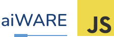

<br />
<p align="center">
  
</p>
<br />

# Aiware.js Vanilla Boilerplate

### A simple way to get started using aiware.js with vanilla javascript.

To reach out the full documentation visit [the official docs](https://docs.veritone.com/#/sdk/initialize-the-sdk).

<br />

## Getting Started

Clone this repo:

```bash
git clone https://github.com/veritone/aiwarejs-vanilla-boilerplate.git
```

CD into it:

```bash
cd aiwarejs-vanilla-boilerplate
```

Run the local dev server:

```bash
python -m SimpleHTTPServer
```

Your local dev environment should be up and running on http://localhost:8000.
<br />
<br />

# Creating a Simple App

To create an app on top of aiware.js simply call the `init` method.

```js
window.aiware.init(
  {
    baseUrl: '<your-base-url>',
    applicationId: '<your-application-id>',
  },
  function () {
    // 🚀 Boot up your app.
  }
);
```

Visit [here](https://docs.veritone.com/#/sdk/initialize-the-sdk) for more about the `init` method.
<br />
<br />

## Example Init Config

```js
window.aiware.init(
  {
    baseUrl: 'https://api.stage.us-1.veritone.com/v3/graphql',
    applicationId: 'app-123',
    withAuth: true,
    authToken: '<your-auth-token>', // Get this from `/v1/admin/current-user`
  },
  function () {
    // 🚀 Boot up your app.
  }
);
```

## Mount a widget

You can mount widgets and configure them depending on your needs. <br/>
Visit [here](https://docs.veritone.com/#/sdk/mount-a-widget) for more about widget mounting.

### Example of mounting a widget

```js
window.aiware.mountWidget({
  name: 'APP_BAR',
  elementId: 'app-bar',
  config: {
    title: 'My Aiware.js Application',
    backgroundColor: '#1f2937',
    zIndex: 1000,
  },
});
```

This will mount an app bar on top of your page.
<br />
<br />

## Making GraphQL Calls

You can run graphql calls against to the base url that you provided in the init config.

```js
var query = `
  query EngineResults($tdo: Int!) {
    engineResults(tdoId: $tdo) {
      records {
        jsondata
      }
    }
  }
`;
var variables = {
  tdo: 'my-tdo-id',
};

window
  .gql(query, variables)
  .then((response) => {
    console.log(response);
  })
  .catch((err) => console.log(err));
```

ℹ️ Keep in mind that the `gql` function is not part of aiware.js and comes out of the box with this boilerplate.
<br />
<br />

## Using Events

To communicate with aiware.js, subscribe to events. To do that, simply call the `on` method with the event name you need. The second callback will be called whenever an event is fired.
Visit [here]() for more about the events.

```js
window.aiware.on('fileUpload', function (error, file) {
  if (error) {
    alert('Error during the file upload!');
    throw error;
  }

  console.log(file);
});
```

### Removing an event

If you want to delete an event that you registered, simply call the `off` method on the `aiware` instance.

```js
window.aiware.off('fileUpload');
// event won't be fired anymore
```
